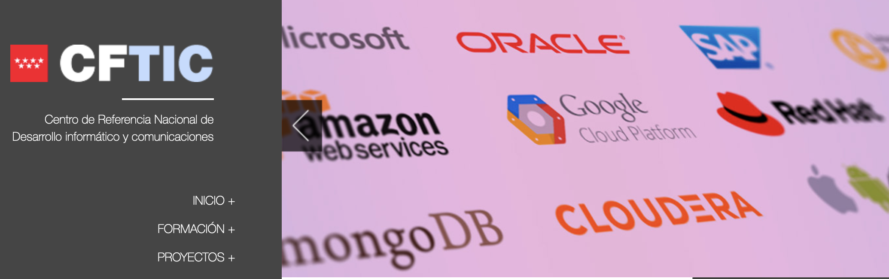

# Curso de LPIC 1 y 2 con Castraining en el Centro de Formación Tecnológica de Getafe

📲 Iniciamos un nuevo curso de LPIC para la certificación en LPIC 1 y 2. En este repositorio iré subiendo todo lo relacionado con el curso y la certificación. Espero que nos sea de mucha ayuda.

🚀 Happy Code!
> ##### Si consideras útil este curso, apóyalo haciendo "★ Star" en el repositorio. ¡Gracias!

## Index
- [Comandos favoritos](Paginas/comandos_favoritos.md)
- [Clases de iniciación a Linux Essential](Paginas/basic.md)
- [Clases de LPIC - 1](Paginas/lpic1.md)
- [Clases de LPIC - 2](Paginas/lpic2.md)
- [Udemy Bash - Intérprete de Comandos de Linux. Aprende desde cero](Paginas/udemyBase.md)
- [Udemy Certificación LPI Linux Essentials: Temario oficial completo](Paginas/udemyEssential.md)
- [Udemy Certificación LPIC-1: Administrador de Linux. EXAMEN 101](Paginas/udemylpic-1.md)

## Help
- [Website of help and interest](Paginas/help.md)
- [Interesting Things](Paginas/interesting.md)

🤩 Enjoy it!
## Enlaces de interés
* Web oficial (Documentación, descarga...): [https://www.lpi.org/es](https://www.lpi.org/es)

### En mi perfil de GitHub tienes más información

#### Puedes apoyar mi trabajo haciendo "☆ Star" en el repo o nominarme a "GitHub Star". ¡Gracias!

